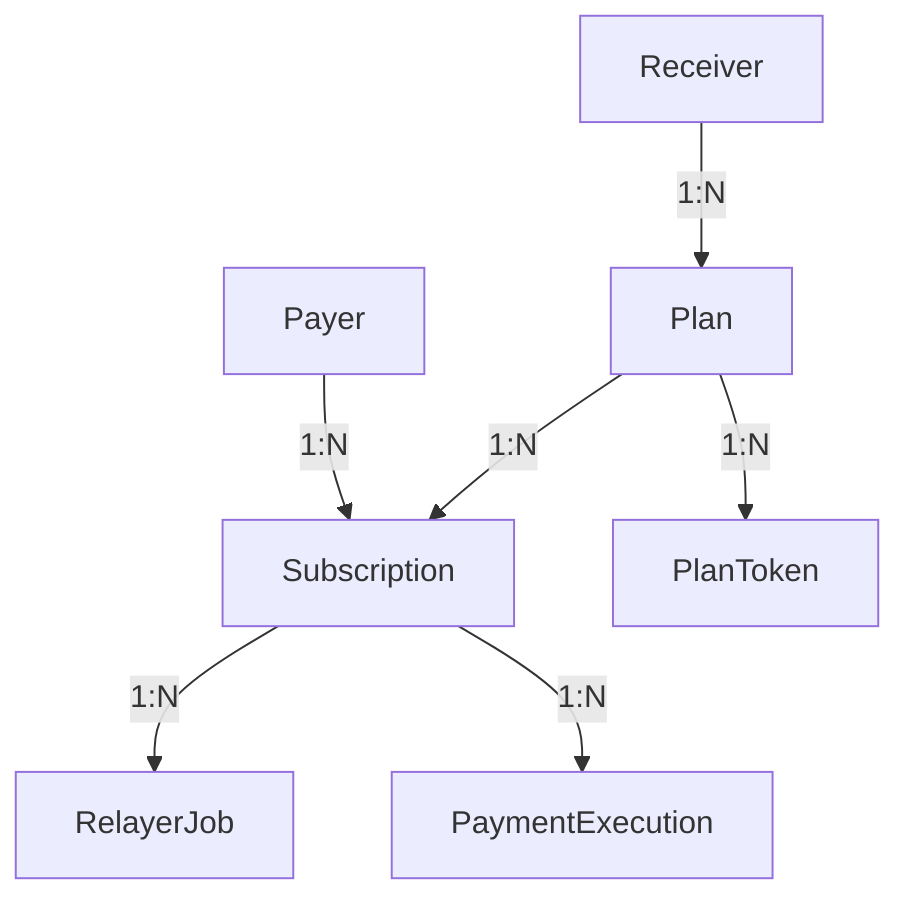

# 🗄️ Modelagem do Banco de Dados - Sistema de Pagamentos Recorrentes Web3

## 📋 Visão Geral

Este documento explica a arquitetura do banco de dados para o sistema de pagamentos recorrentes em Solana, baseado no modelo **Delegate + Relayer** com automação via cronjobs.

---

## 🏗️ Arquitetura Geral

O sistema permite que usuários autorizem um programa/relayer a cobrar automaticamente valores recorrentes **sem precisar assinar cada transação** e **sem custódia de chaves**.

### Fluxo Principal:

1. **Payer** conecta wallet e aprova delegate
2. **Subscription** é criada com autorização
3. **RelayerJob** agenda execução de pagamentos
4. **PaymentExecution** registra resultados das transações

---

## 📊 Tabelas e Relacionamentos

### 1. **Payer** (Pagadores)

```sql
-- Usuários que fazem pagamentos recorrentes
model Payer {
  id            String   @id @default(uuid())
  walletAddress String   @unique  -- Endereço da wallet Solana
  name          String             -- Nome do pagador
  email         String?            -- Email opcional
  createdAt     DateTime @default(now())
  updatedAt     DateTime @updatedAt

  subscriptions Subscription[]     -- Relação 1:N
}
```

**Função**: Armazena informações dos usuários que fazem pagamentos recorrentes.

---

### 2. **Receiver** (Recebedores)

```sql
-- Empresas/serviços que recebem pagamentos
model Receiver {
  id               String   @id @default(uuid())
  walletAddress    String   @unique  -- Wallet principal
  name             String             -- Nome da empresa/serviço
  description      String?            -- Descrição opcional
  tokenAccountUSDT String             -- Conta específica para USDT
  tokenAccountUSDC String             -- Conta específica para USDC
  createdAt        DateTime @default(now())
  updatedAt        DateTime @updatedAt

  plans Plan[]                        -- Relação 1:N
}
```

**Função**: Empresas/serviços que oferecem planos de assinatura. Cada token tem sua própria conta para receber pagamentos.

---

### 3. **Plan** (Planos de Assinatura)

```sql
-- Planos oferecidos pelos receivers
model Plan {
  id             String   @id @default(uuid())
  receiverId     String   -- FK para Receiver
  name           String   -- Nome do plano (ex: "Netflix Premium")
  description    String?  -- Descrição do plano
  durationMonths Int      -- Duração em meses
  periodSeconds  Int      -- Período entre cobranças (em segundos)
  createdAt      DateTime @default(now())
  updatedAt      DateTime @updatedAt

  receiver     Receiver       @relation(fields: [receiverId], references: [id])
  subscriptions Subscription[] -- Relação 1:N
  planTokens    PlanToken[]    -- Relação 1:N
}
```

**Função**: Define planos de assinatura com duração e periodicidade específicas.

---

### 4. **PlanToken** (Tokens Aceitos por Plano)

```sql
-- Tokens aceitos e preços específicos por plano
model PlanToken {
  id            String   @id @default(uuid())
  planId        String   -- FK para Plan
  tokenDecimals Int      -- Decimais do token
  tokenMint     String   -- Endereço do token SPL
  price         Decimal  -- Preço específico neste plano
  createdAt     DateTime @default(now())
  updatedAt     DateTime @updatedAt

  plan Plan @relation(fields: [planId], references: [id])
}
```

**Função**: Permite que um plano aceite múltiplos tokens com preços específicos. Ex: Netflix Premium pode custar $15.99 em USDC ou $15.99 em USDT.

---

### 5. **Subscription** (Assinaturas Ativas)

```sql
-- Assinaturas ativas dos payers
model Subscription {
  id                  String             @id @default(uuid())
  planId              String             -- FK para Plan
  payerId             String             -- FK para Payer
  token_mint          String             -- Token escolhido para pagamento
  status              SubscriptionStatus @default(ACTIVE)
  nextDueAt           DateTime           -- Próxima data de cobrança
  lastPaidAt          DateTime           -- Última cobrança realizada
  delegateAuthority   String?            -- Autoridade delegada para cobrança
  delegateTxSignature String?            -- Assinatura da transação de delegate
  delegateApprovedAt  DateTime?          -- Data da aprovação do delegate
  tokenDecimals       Int                -- Decimais do token
  totalApprovedAmount Decimal            -- Valor total aprovado para cobrança
  createdAt           DateTime @default(now())
  updatedAt           DateTime @updatedAt

  payer Payer @relation(fields: [payerId], references: [id])
  plan  Plan  @relation(fields: [planId], references: [id])
  relayerJobs RelayerJob[]               -- Relação 1:N
}
```

**Função**: Assinaturas ativas que conectam payers a planos específicos, com autorização de delegate para cobrança automática.

---

### 6. **RelayerJob** (Jobs de Cobrança)

```sql
-- Jobs para execução de cobranças
model RelayerJob {
  id             String           @id @default(uuid())
  subscriptionId String           -- FK para Subscription
  nextRetryAt    DateTime         -- Próxima tentativa de execução
  executedAt     DateTime?        -- Data de execução (se bem-sucedida)
  status         RelayerJobStatus @default(PENDING)

  subscription Subscription @relation(fields: [subscriptionId], references: [id])
}
```

**Função**: Sistema de jobs para execução assíncrona de cobranças, com retry automático para falhas temporárias.

**Estados**:

- `PENDING`: Aguardando processamento
- `SUCCESS`: Cobrança executada com sucesso
- `FAILED`: Falhou, aguardando retry

---

### 7. **PaymentExecution** (Execuções de Pagamento)

```sql
-- Registro das execuções de pagamento
model PaymentExecution {
  id             String                 @id @default(uuid())
  subscriptionId String                 -- FK para Subscription
  txSignature    String                 -- Assinatura da transação na blockchain
  executedBy     String?                -- Quem executou (relayer/worker)
  status         PaymentExecutionStatus -- SUCCESS ou FAILED
  executedAt     DateTime               -- Data/hora da execução
  errorMessage   String?                -- Mensagem de erro (se falhou)
  tokenMint      String                 -- Token utilizado
  amount         Decimal                -- Valor cobrado
}
```

**Função**: Auditoria completa de todas as tentativas de cobrança, incluindo sucessos e falhas.

---

## 🔗 Relacionamentos Principais



### Fluxo de Dados:

1. **Payer** cria **Subscription** para um **Plan**
2. **Plan** define **PlanToken**s aceitos e preços
3. **RelayerJob** agenda cobrança da **Subscription**
4. **PaymentExecution** registra resultado da cobrança

---

## ⚙️ Fluxo de Cobrança

### 1. **Criação de Assinatura**

```typescript
// 1. Payer aprova delegate para seu token account
await approveDelegate(payerTokenAccount, relayerAuthority, amount);

// 2. Sistema cria Subscription
const subscription = await prisma.subscription.create({
  data: {
    payerId: payer.id,
    planId: plan.id,
    token_mint: "USDC_MINT",
    delegateAuthority: relayerAuthority,
    nextDueAt: calculateNextDueDate(),
    // ... outros campos
  },
});
```

### 2. **Agendamento de Cobrança**

```typescript
// Cronjob cria jobs para subscriptions vencidas
const dueSubscriptions = await prisma.subscription.findMany({
  where: {
    nextDueAt: { lte: new Date() },
    status: "ACTIVE",
  },
});

// Criar RelayerJob para cada subscription
await prisma.relayerJob.createMany({
  data: dueSubscriptions.map((sub) => ({
    subscriptionId: sub.id,
    nextRetryAt: new Date(),
    status: "PENDING",
  })),
});
```

### 3. **Execução de Cobrança**

```typescript
// Worker processa RelayerJob
const job = await prisma.relayerJob.findFirst({
  where: { status: "PENDING" },
  include: { subscription: { include: { plan: true } } },
});

try {
  // Executar transfer_from() no programa Anchor
  const result = await executePayment(job.subscription);

  // Registrar sucesso
  await prisma.$transaction([
    prisma.paymentExecution.create({
      data: {
        subscriptionId: job.subscriptionId,
        txSignature: result.signature,
        status: "SUCCESS",
        amount: planToken.price,
      },
    }),
    prisma.relayerJob.update({
      where: { id: job.id },
      data: { status: "SUCCESS", executedAt: new Date() },
    }),
  ]);
} catch (error) {
  // Agendar retry
  await prisma.relayerJob.update({
    where: { id: job.id },
    data: {
      status: "FAILED",
      nextRetryAt: new Date(Date.now() + 5 * 60 * 1000), // 5 min
    },
  });
}
```

---

## 🎯 Benefícios da Arquitetura

### **Flexibilidade**

- Suporte a múltiplos tokens por plano
- Preços específicos por token
- Fácil adição de novos tokens

### **Confiabilidade**

- Sistema de retry automático
- Auditoria completa de transações
- Controle de estado granular

### **Escalabilidade**

- Processamento assíncrono de jobs
- Workers distribuídos
- Monitoramento detalhado

### **Segurança**

- Delegate authority sem custódia
- Rastreamento completo de transações
- Controle de permissões granular

---

## 📝 Considerações de Design

### **Por que RelayerJob separado?**

- **Retry automático**: Falhas temporárias são reprocessadas
- **Processamento assíncrono**: Não bloqueia o cronjob principal
- **Auditoria**: Rastreamento completo do estado dos jobs
- **Escalabilidade**: Workers podem ser distribuídos

### **Por que PlanToken separado?**

- **Flexibilidade**: Um plano pode aceitar múltiplos tokens
- **Preços específicos**: Cada token tem seu preço no plano
- **Escalabilidade**: Fácil adição de novos tokens

### **Por que contas de token específicas no Receiver?**

- **Arquitetura Solana**: Cada token precisa de conta separada
- **Organização**: Gestão de fundos por tipo de token
- **Rastreabilidade**: Identificação clara de pagamentos

---

## 🚀 Próximos Passos

1. **Implementar programa Anchor** com instruções de cobrança
2. **Criar workers** para processamento de RelayerJob
3. **Desenvolver frontend** para criação de assinaturas
4. **Implementar monitoramento** e alertas
5. **Adicionar testes** para todos os fluxos críticos
