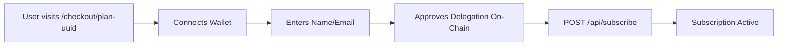
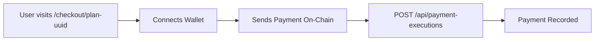

# PattPay Payment Flows

Complete guide for implementing recurring subscriptions and one-time payments in PattPay.

---

## 📋 Overview

PattPay supports two distinct payment flows:

| Type                       | Endpoint                       | Auth      | Use Case                                            |
| -------------------------- | ------------------------------ | --------- | --------------------------------------------------- |
| **Recurring Subscription** | `POST /api/subscribe`          | ❌ Public | Monthly/yearly subscriptions with automatic billing |
| **One-Time Payment**       | `POST /api/payment-executions` | ❌ Public | Single payment for products/services                |

**Key Difference:**

- **Recurring**: User delegates authority to a relayer via on-chain PDA, relayer charges automatically
- **One-Time**: User sends payment directly via wallet, frontend records the transaction

---

## 🔄 Recurring Subscriptions

### Frontend Flow



### Step 1: User Approves Delegation

```typescript
import { approve_delegate } from "./solana-contract";

// User approves delegation on Solana
const { signature, delegateAuthority } = await approve_delegate({
  subscriptionId: uuidv4(),
  approvedAmount: totalAmount, // e.g., $10/month * 12 months = $120
  payer: walletAddress,
  receiver: planReceiverWallet,
  tokenMint: selectedToken.mint, // USDC, USDT, etc.
  tokenAccount: userTokenAccount,
});
```

### Step 2: Call Subscribe Endpoint

```typescript
POST /api/subscribe
Content-Type: application/json

{
  "payer": {
    "walletAddress": "9WzDXwBbmkg8ZTbNMqUxvQRAyrZzDsGYdLVL9zYtAWWM",
    "name": "John Doe",
    "email": "john@example.com" // Optional
  },
  "planId": "uuid",
  "tokenMint": "EPjFWdd5AufqSSqeM2qN1xzybapC8G4wEGGkZwyTDt1v", // USDC
  "delegateTxSignature": "5j7s8k9d...",
  "delegateAuthority": "DgJ8Tz3X...", // PDA address
  "delegateApprovedAt": "2025-10-30T10:30:00.000Z"
}
```

### Success Response (201)

```json
{
  "message": "Subscription created successfully",
  "subscription": {
    "id": "uuid",
    "planId": "uuid",
    "payerId": "uuid",
    "tokenMint": "EPjFWdd5AufqSSqeM2qN1xzybapC8G4wEGGkZwyTDt1v",
    "status": "ACTIVE",
    "nextDueAt": "2025-11-30T10:30:00.000Z",
    "lastPaidAt": "2025-10-30T10:30:00.000Z",
    "totalApprovedAmount": "120.00",
    "plan": {
      /* Plan details */
    },
    "payer": {
      /* Payer details */
    }
  },
  "payer": {
    "id": "uuid",
    "walletAddress": "9WzDXwBbmkg8ZTbNMqUxvQRAyrZzDsGYdLVL9zYtAWWM",
    "name": "John Doe",
    "email": "john@example.com",
    "isNew": true // true if just created, false if existing
  }
}
```

### Error Responses

| Status | Error                      | Solution                                            |
| ------ | -------------------------- | --------------------------------------------------- |
| `400`  | Plan is not recurring      | Use `/api/payment-executions` for one-time payments |
| `404`  | Plan not found             | Check `planId` is valid                             |
| `409`  | Active subscription exists | User already subscribed to this plan                |

### Frontend Implementation

```typescript
async function subscribeToRecurringPlan(
  planId: string,
  walletAddress: string,
  userName: string,
  userEmail?: string
) {
  try {
    // 1. Approve delegation on-chain
    const { signature, delegateAuthority } = await approve_delegate({
      subscriptionId: uuidv4(),
      approvedAmount: calculateTotal(plan),
      payer: walletAddress,
      receiver: plan.receiver.walletAddress,
      tokenMint: selectedToken.mint,
      tokenAccount: userTokenAccount,
    });

    // 2. Create subscription
    const response = await fetch("/api/subscribe", {
      method: "POST",
      headers: { "Content-Type": "application/json" },
      body: JSON.stringify({
        payer: {
          walletAddress: walletAddress.toString(),
          name: userName,
          email: userEmail,
        },
        planId,
        tokenMint: selectedToken.mint,
        delegateTxSignature: signature,
        delegateAuthority: delegateAuthority.toString(),
        delegateApprovedAt: new Date().toISOString(),
      }),
    });

    if (!response.ok) {
      const error = await response.json();
      throw new Error(error.message);
    }

    const { subscription, payer } = await response.json();

    // Success! Redirect to confirmation
    window.location.href = plan.redirectUrl || "/success";
  } catch (error) {
    console.error("Subscription failed:", error);
    alert("Failed to create subscription. Please try again.");
  }
}
```

### What Happens Next?

1. **Backend** creates/retrieves payer and subscription records
2. **Relayer** monitors `nextDueAt` for all active subscriptions
3. **Relayer** automatically charges subscription when due
4. **Backend** creates `payment_execution` record for each charge
5. User can cancel subscription via dashboard

---

## 💳 One-Time Payments

### Frontend Flow



### Step 1: User Pays Directly

```typescript
import { transferTokens } from "./solana-contract";

// User sends payment directly to merchant
const signature = await transferTokens({
  from: userWallet,
  to: merchantWallet,
  amount: planAmount,
  tokenMint: selectedToken.mint,
});

// Wait for confirmation
await connection.confirmTransaction(signature);
```

### Step 2: Record Payment Execution

```typescript
POST /api/payment-executions
Content-Type: application/json

{
  "planId": "uuid",
  "txSignature": "5j7s8k9d3k2l...",
  "tokenMint": "EPjFWdd5AufqSSqeM2qN1xzybapC8G4wEGGkZwyTDt1v",
  "amount": 10.5,
  "executedBy": "9WzDXwBbmkg8ZTbNMqUxvQRAyrZzDsGYdLVL9zYtAWWM" // Optional
}
```

### Success Response (201)

```json
{
  "message": "Payment execution recorded successfully",
  "paymentExecution": {
    "id": "uuid",
    "planId": "uuid",
    "subscriptionId": null,
    "txSignature": "5j7s8k9d3k2l...",
    "executedBy": "9WzDXwBbmkg8ZTbNMqUxvQRAyrZzDsGYdLVL9zYtAWWM",
    "status": "SUCCESS",
    "executedAt": "2025-10-30T10:30:00.000Z",
    "tokenMint": "EPjFWdd5AufqSSqeM2qN1xzybapC8G4wEGGkZwyTDt1v",
    "amount": "10.5",
    "plan": {
      /* Plan details */
    }
  }
}
```

### Error Responses

| Status | Error                      | Solution                                 |
| ------ | -------------------------- | ---------------------------------------- |
| `400`  | Plan is recurring          | Use `/api/subscribe` for recurring plans |
| `404`  | Plan not found             | Check `planId` is valid                  |
| `409`  | Transaction already exists | Payment already recorded                 |

### Frontend Implementation

```typescript
async function payOneTimePayment(
  planId: string,
  walletAddress: string,
  amount: number,
  tokenMint: string
) {
  try {
    // 1. Send payment on-chain
    const signature = await transferTokens({
      from: walletAddress,
      to: merchantWallet,
      amount,
      tokenMint,
    });

    // 2. Wait for confirmation
    await connection.confirmTransaction(signature);

    // 3. Record payment in backend
    const response = await fetch("/api/payment-executions", {
      method: "POST",
      headers: { "Content-Type": "application/json" },
      body: JSON.stringify({
        planId,
        txSignature: signature,
        tokenMint,
        amount,
        executedBy: walletAddress.toString(),
      }),
    });

    if (!response.ok) {
      const error = await response.json();
      throw new Error(error.message);
    }

    const { paymentExecution } = await response.json();

    // Success! Redirect to confirmation
    window.location.href = plan.redirectUrl || "/success";
  } catch (error) {
    console.error("Payment failed:", error);
    alert("Failed to process payment. Please try again.");
  }
}
```

---

## 🎯 Frontend Integration Guide

### Universal Checkout Page

```typescript
// /checkout/[planId]/page.tsx

export default function CheckoutPage({
  params,
}: {
  params: { planId: string };
}) {
  const [plan, setPlan] = useState<Plan | null>(null);
  const [selectedToken, setSelectedToken] = useState<Token | null>(null);
  const { publicKey, signTransaction } = useWallet();

  useEffect(() => {
    // Fetch plan details
    fetch(`/api/plans/${params.planId}`)
      .then((res) => res.json())
      .then((data) => setPlan(data));
  }, [params.planId]);

  const handlePayment = async () => {
    if (!plan || !selectedToken || !publicKey) return;

    if (plan.isRecurring) {
      // Recurring subscription flow
      await subscribeToRecurringPlan(
        plan.id,
        publicKey.toString(),
        userName,
        userEmail
      );
    } else {
      // One-time payment flow
      await payOneTimePayment(
        plan.id,
        publicKey.toString(),
        plan.amount,
        selectedToken.mint
      );
    }
  };

  return (
    <div>
      <h1>{plan?.name}</h1>
      <p>{plan?.description}</p>

      {plan?.isRecurring ? (
        <>
          <p>
            💳 Recurring: ${plan.amount}/month for {plan.durationMonths} months
          </p>
          <input
            type="text"
            placeholder="Your name"
            value={userName}
            onChange={(e) => setUserName(e.target.value)}
          />
          <input
            type="email"
            placeholder="Your email (optional)"
            value={userEmail}
            onChange={(e) => setUserEmail(e.target.value)}
          />
        </>
      ) : (
        <p>💰 One-time payment: ${plan.amount}</p>
      )}

      <TokenSelector
        tokens={plan?.tokens}
        selected={selectedToken}
        onChange={setSelectedToken}
      />

      <WalletMultiButton />

      <button onClick={handlePayment} disabled={!publicKey}>
        {plan?.isRecurring ? "Subscribe" : "Pay Now"}
      </button>
    </div>
  );
}
```

---

## 🧪 Testing Scenarios

### Scenario 1: New Recurring Subscription

✅ User has never subscribed before  
✅ Creates payer record  
✅ Creates subscription  
✅ Returns `isNew: true`

### Scenario 2: Same Wallet, Different Name

✅ User subscribes with same wallet but different name  
✅ Creates new payer (composite unique key: wallet + name)  
✅ Creates new subscription  
✅ Both subscriptions active

### Scenario 3: Existing Payer

✅ User with existing payer record subscribes to new plan  
✅ Reuses existing payer  
✅ Creates subscription  
✅ Returns `isNew: false`

### Scenario 4: Duplicate Subscription

❌ User tries to subscribe to same plan twice  
❌ Returns 409 Conflict  
❌ Shows existing subscription ID

### Scenario 5: One-Time Payment

✅ User pays directly via wallet  
✅ Frontend records transaction  
✅ Backend creates payment execution  
✅ `subscriptionId: null`

### Scenario 6: Duplicate Transaction

❌ Same transaction signature submitted twice  
❌ Returns 409 Conflict  
❌ Shows existing payment execution ID

### Scenario 7: Wrong Endpoint Usage

❌ One-time plan → `/api/subscribe`: Returns 400  
❌ Recurring plan → `/api/payment-executions`: Returns 400

---

## 🔒 Security Considerations

### Current Implementation

⚠️ Both endpoints trust frontend data without on-chain verification

### TODO: On-Chain Verification

#### For `/api/subscribe`:

```typescript
// Verify delegation transaction
// 1. Fetch transaction by delegateTxSignature
// 2. Verify transaction is confirmed
// 3. Verify PDA matches delegateAuthority
// 4. Verify approved amount matches plan total
```

#### For `/api/payment-executions`:

```typescript
// Verify payment transaction
// 1. Fetch transaction by txSignature
// 2. Verify transaction is confirmed
// 3. Verify amount matches plan amount
// 4. Verify recipient is plan receiver
// 5. Verify token mint matches
```

### Rate Limiting

⚠️ TODO: Implement rate limiting on public endpoints

- Suggested: 10 requests/minute per IP for `/api/subscribe`
- Suggested: 20 requests/minute per IP for `/api/payment-executions`

---

## 📊 Database Schema

### Payer Table

```sql
CREATE TABLE payers (
  id UUID PRIMARY KEY,
  wallet_address TEXT NOT NULL,
  name TEXT NOT NULL,
  email TEXT,
  created_at TIMESTAMP DEFAULT NOW(),
  updated_at TIMESTAMP DEFAULT NOW(),
  UNIQUE(wallet_address, name) -- Composite unique constraint
);
```

### Subscription Table

```sql
CREATE TABLE subscriptions (
  id UUID PRIMARY KEY,
  plan_id UUID REFERENCES plans(id),
  payer_id UUID REFERENCES payers(id),
  token_mint TEXT NOT NULL,
  status TEXT CHECK (status IN ('ACTIVE', 'CANCELLED', 'EXPIRED')),
  next_due_at TIMESTAMP,
  last_paid_at TIMESTAMP,
  delegate_authority TEXT NOT NULL,
  delegate_tx_signature TEXT NOT NULL,
  delegate_approved_at TIMESTAMP NOT NULL,
  token_decimals INTEGER NOT NULL,
  total_approved_amount DECIMAL(20, 10) NOT NULL,
  created_at TIMESTAMP DEFAULT NOW(),
  updated_at TIMESTAMP DEFAULT NOW()
);
```

### Payment Execution Table

```sql
CREATE TABLE payment_executions (
  id UUID PRIMARY KEY,
  plan_id UUID REFERENCES plans(id),
  subscription_id UUID REFERENCES subscriptions(id) NULL,
  tx_signature TEXT UNIQUE NOT NULL,
  executed_by TEXT,
  status TEXT CHECK (status IN ('SUCCESS', 'FAILED')),
  executed_at TIMESTAMP DEFAULT NOW(),
  token_mint TEXT NOT NULL,
  amount DECIMAL(20, 10) NOT NULL,
  error_message TEXT
);
```

---

## 🚀 Deployment Checklist

### Before Deploy

- [x] Database migration created and applied
- [x] Prisma client regenerated
- [x] No linter/TypeScript errors
- [x] Routes documented in Swagger
- [ ] On-chain verification implemented
- [ ] Rate limiting configured
- [ ] Integration tests passing

### Deploy Steps

1. Apply database migration to production
2. Deploy backend with new routes
3. Verify `/docs` shows new endpoints
4. Test with Postman/curl
5. Deploy frontend
6. Monitor error logs

---

## ❓ FAQ

**Q: When should I use `/api/subscribe` vs `/api/payment-executions`?**  
A: Use `/api/subscribe` for recurring plans. Use `/api/payment-executions` for one-time payments.

**Q: What if the user already has an active subscription?**  
A: The API returns a 409 Conflict error with the existing subscription ID.

**Q: Can users subscribe to different plans with the same wallet?**  
A: Yes! They can even subscribe to the same plan with different names.

**Q: What happens if payment fails?**  
A: For recurring: Relayer retries and marks subscription as EXPIRED if persistent failure. For one-time: User must retry the payment.

**Q: How do I cancel a subscription?**  
A: Use `PUT /api/subscriptions/:id/cancel` (authenticated endpoint for merchants).

**Q: Are these endpoints authenticated?**  
A: No, both are public endpoints. Payers don't need accounts. Merchants need accounts to view payment history.

---

## 📚 Related Endpoints

### For Merchants (Authenticated)

```http
GET    /api/subscriptions          # List subscriptions
GET    /api/subscriptions/:id      # Get subscription details
PUT    /api/subscriptions/:id/cancel  # Cancel subscription
GET    /api/payment-executions     # List payment history
GET    /api/payment-executions/:id # Get payment details
```

### For Plans (Authenticated)

```http
GET    /api/plans                  # List plans
POST   /api/plans                  # Create plan
GET    /api/plans/:id              # Get plan details
PUT    /api/plans/:id              # Update plan
DELETE /api/plans/:id              # Delete plan
```

---

**Last Updated:** October 30, 2025  
**Version:** 1.0.0  
**Status:** ✅ Ready for Frontend Integration

For full API documentation, see `/docs` (Swagger UI) when backend is running.
